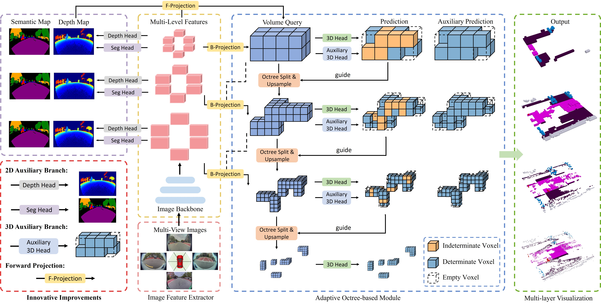

# ParkOcc
ParkOcc: A Novel Dataset and Benchmark for Surround-view Fisheye 3D Semantic Occupancy Prediction in Valet Parking Scenarios

## News
* **2024-12-21**: We release the code, model weights, and part of the dataset.

## Introduction
In this paper, we propose ParkOcc, the first dataset and benchmark for surround-view fisheye semantic occupancy perception in parking scenarios. Specifically, we develop a cost-effective pipeline to construct a high-quality dataset from scratch and introduce specific evaluation metrics. And we establish several camera-based baselines for easy comparison in this benchmark. By providing a diverse set of surround-view parking scenes, we hope to help the industry in building a more secure advanced driving assistance system for valet parking. Furthermore, building on our previous work [AdaptiveOcc](https://github.com/yty-sky/AdaptiveOcc), we propose our new model AdaptiveOcc v2, which utilizes joint forward and backward projection along with 2D and 3D auxiliary branches to achieve accurate performance.  

## Highlights

### Dateset construct pipeline

  

### Enhanced network with auxiliary branches

  

### ParkOcc dataset visualization

  

### Demo

  

## Getting Started
- [Installation](docs/install.md) 
- [Prepare Dataset](docs/data.md)
- [Train, Eval and Visualize](docs/run.md)\
You can download our [pretrained backbone](https://jbox.sjtu.edu.cn/l/61lWmi) and [model weights](https://jbox.sjtu.edu.cn/l/21l24o).

## Acknowledgement
Many thanks to these excellent open-source projects:
- [BEVFormer](https://github.com/fundamentalvision/BEVFormer)
- [SurroundOcc](https://github.com/weiyithu/SurroundOcc)
- [FlashOcc](https://github.com/Yzichen/FlashOCC)
- [SparseOcc](https://github.com/MCG-NJU/SparseOcc)
- [O-CNN](https://github.com/octree-nn/ocnn-pytorch)

